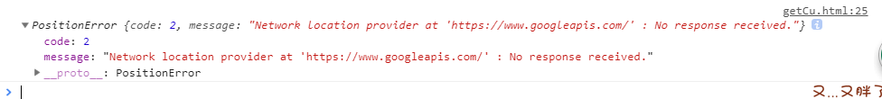

# 地理位置

HTML5 Geolocation API 用于获得用户的地理位置。

鉴于该特性可能侵犯用户的隐私，除非用户同意，否则用户位置信息是不可用的。
下例是一个简单的地理定位实例，可返回用户位置的经度和纬度。
地理定位：使用 JS 获取浏览器当前所在的地理坐标，实现 LBS（Location Based Service，基于定位的服务），具体数据包括：

-   经度：longitude
-   纬度：latitude
-   海拔：altitude
-   速度：speed

技术上如何获取浏览器所在的定位信息：

1. 手机中的浏览器
   靠手机内置的 GPS 芯片数据，精度在“米”级
   靠手机与之通讯基站数据，精度在“公里”级。
2. PC 中的浏览器
   靠 IP 地址反向解析，精度在“公里”级。

```js
<script>
var x=document.getElementById("demo");
function getLocation()
  {
  if (navigator.geolocation)
    {
    navigator.geolocation.getCurrentPosition(showPosition);
    }
  else{x.innerHTML="Geolocation is not supported by this browser.";}
  }
function showPosition(position)
  {
  x.innerHTML="Latitude: " + position.coords.latitude +
  "<br />Longitude: " + position.coords.longitude;
  }
</script>
```

::: danger
该方法在 IP 地址反向解析中默认用的是`https://www.googleapis.com/`,所以只有翻墙才能使用。
:::
点击[此处](https://homobulla.site/Technical-tree/code/getCu.html)查看在线演示。
返回结果：

