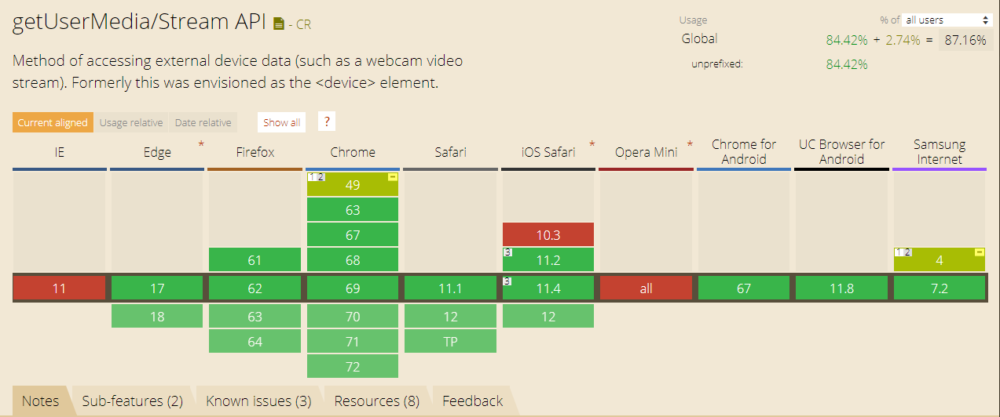

# getUserMedia

提起移动端调用设备摄像头，我们很容易就想到借助 [PhoneGap](http://www.phonegapcn.com/docs/zh/1.4.1/) 或 [Cordova](http://cordova.axuer.com/) 。如果只是想在 Web 页面简单的用一下，那不妨试试 HTML5 的 User Media API 。

`MediaDevices.getUserMedia()` 会提示用户给予使用媒体输入的许可，媒体输入会产生一个 `MediaStream`，里面包含了请求的媒体类型的轨道。此流可以包含一个视频轨道（来自硬件或者虚拟视频源，比如相机、视频采集设备和屏幕共享服务等等）、一个音频轨道（同样来自硬件或虚拟音频源，比如麦克风、A/D 转换器等等），也可能是其它轨道类型。

### 支持情况



### 语法

`var promise = navigator.mediaDevices.getUserMedia(constraints)`

#### 参数

-   constraints
    作为一个 MediaStreamConstraints 对象，指定了请求的媒体类型和相对应的参数。

#### 返回值

返回一个 `Promise` ， 这个 `Promise` 成功后的回调函数带一个 `MediaStream` 对象作为其参数

#### 异常

返回一个 `Promise` ， 这个`Promise`成功后的回调函数带一个 `MediaStream`对象作为其参数。

```js
;-(function() {
    var video = document.querySelector('#video')
    var myConstraints = {
        video: {
            facingMode: 'user' // 优先调用前置摄像头
        }
    }

    navigator.mediaDevices.getUserMedia(myConstraints).then(
        stream => {
            video.src = window.URL.createObjectURL(stream)
            video.play()
        },
        error => {
            console.error(error.name || error)
        }
    )
})()
```

点击[此处](https://homobulla.site/Technical-tree/code/getUserMedia.html)，查看上述代码在移动端上的表现。(请用手机打开该网页)
